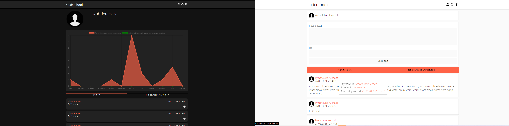

# STUDENTbook

#### A fullstack project of a social media application for students

> description: to do...

## About server
#### Database scheme
``` sql
create table Users (
	userId int identity(1,1) primary key,
	universityId int,
	nick varchar(64) not null UNIQUE,
	firstName varchar(64),
	lastName varchar(64),
	email varchar(128) not null,
	password varchar(128) not null,
	createdAt datetime not null,
	lastLogginIn datetime
	foreign key (universityId) references University(universityId)
)

create table Posts (
	postId int identity(1,1) primary key,
	userId int,
	tag varchar(64),
	content text,
	createdAt datetime,
	editedAt datetime
	foreign key (userId) references Users(userId)
)

create table PostAnswers (
	answerId int identity(1,1) primary key,
	postId int not null,
	userId int not null,
	content text not null,
	createdAt datetime not null,
	editedAt datetime,
	foreign key (userId) references Users(userId),
	foreign key (postId) references Posts(postId)
)

create table University (
	universityId int identity(1,1) primary key,
	name varchar(128),
	city varchar(64)
)
```
#### API methods
##### Users
- GET: /api/Users
- GET: /api/Users/{userId}
- POST: /api/Users/ + User model in body
- PUT /api/Users/{userId} + User model in body
- DELETE /api/Users/{userId}

##### Posts 
- GET: /api/Posts
- GET: /api/Posts/{postId}
- GET: /api/Posts/GetBy/username/{userName}
- POST: /api/Posts/{userId} + Post model in body
- PUT: /api/Posts/{postId} + Post model in body
- DELETE: /api/Posts/{postId}

##### Post Answer 
- GET: /api/PostAnswers/
- GET: /api/PostAnswers/{postId}
- GET: /api/PostAnswers/GetBy/username/{userName}
- POST: /api/PostAnswers/{postAnswerId} + PostAnswer model in body
- PUT: /api/PostAnswers/{postAnswerId} + PostAnwser model in body
- DELETE: /api/PostAnswers/{postAnswerId} 

##### University
- GET: /api/PostAnswers/
- GET: /api/PostAnswers/{universityId}
- POST: /api/PostAnswers/{universityId} + University model in body, only for nick admin account
- PUT: /api/PostAnswers/{universityId} + University model in body, only for nick admin account
- DELETE: /api/PostAnswers/{postAnswerId} only for nick admin account

## About client
...

## Technologies
#### Server
- ASP NET Web API (LogN, Basic Authorization, ADO.NET Entity Data Model)
- SQL Server

#### Client
- React,
- React Router,
- React Icons,
- Styled Components,
- Axios
- Chart.js (react-chartjs-2)

## Visualization of progress in developing project 
#### (state: 28.06)

